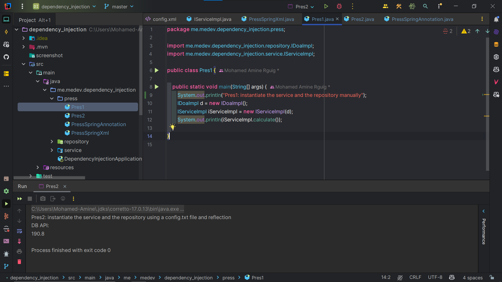
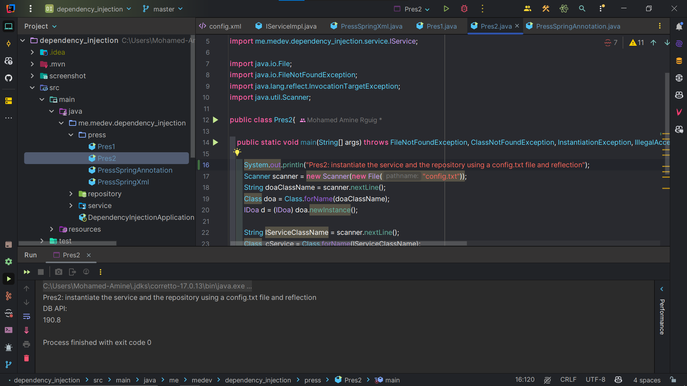
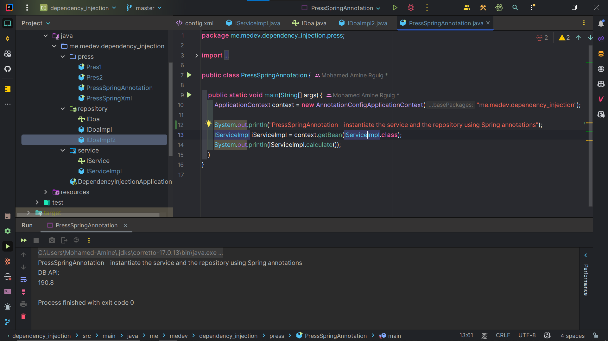
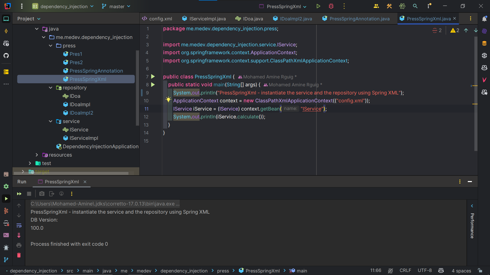

# Projet de Démonstration d'Injection de Dépendances

Ce projet est une démonstration des différentes approches d'injection de dépendances en Java, notamment avec Spring.

## Structure du Projet

- **repository**: Contient les interfaces et implémentations pour l'accès aux données

  - `IDoa.java`: Interface définissant la méthode d'accès aux données
  - `IDoaImpl.java`: Première implémentation qui retourne 1000
  - `IDoaImpl2.java`: Seconde implémentation qui retourne 1908

- **service**: Contient les services qui utilisent les repositories

  - `IService.java`: Interface définissant la méthode de calcul
  - `IServiceImpl.java`: Implémentation du service qui utilise IDoa

- **press**: Contient les différentes démonstrations d'injection de dépendances
  - `Pres1.java`: Injection de dépendances manuelle
  - `Pres2.java`: Injection de dépendances avec réflexion et configuration par fichier
  - `PressSpringAnnotation.java`: Injection de dépendances avec Spring et annotations
  - `PressSpringXml.java`: Injection de dépendances avec Spring et configuration XML

## Approches d'Injection de Dépendances

1. **Injection Manuelle** (Pres1.java)

   - Création directe des instances et injection explicite

2. **Injection par Réflexion** (Pres2.java)

   - Utilisation de la réflexion Java pour charger et instancier des classes dynamiquement
   - Configuration via un fichier texte externe

3. **Injection par Spring avec Annotations** (PressSpringAnnotation.java)

   - Utilisation du contexte Spring et des annotations comme @Service et @Repository
   - Configuration automatique par scan de package

4. **Injection par Spring avec XML** (PressSpringXml.java)
   - Utilisation du contexte Spring avec configuration XML
   - Définition des beans et de leurs dépendances dans config.xml

## Comment Exécuter

Pour tester les différentes approches, lancez les classes correspondantes dans le package `press`.
Chaque classe démontre une approche différente d'injection de dépendances.

## Screenshots

1. **Injection Manuelle Pres1.java**
   
2. **Injection par Réflexion Pres2.java**
   
3. **Injection par Spring avec Annotations PressSpringAnnotation.java**
   
4. **Injection par Spring avec XML PressSpringXml.java**
   
